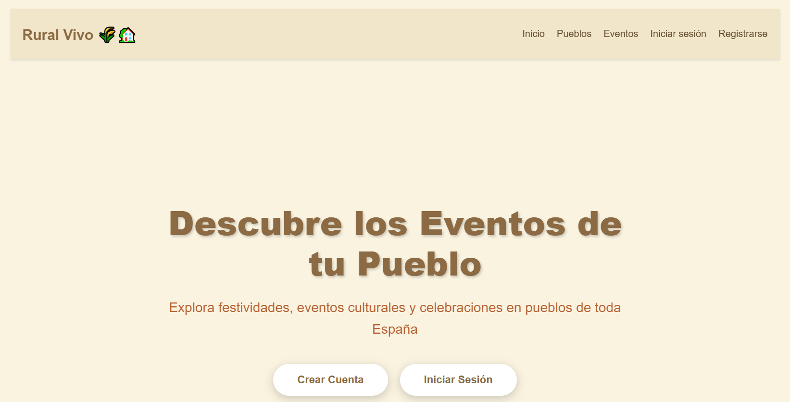
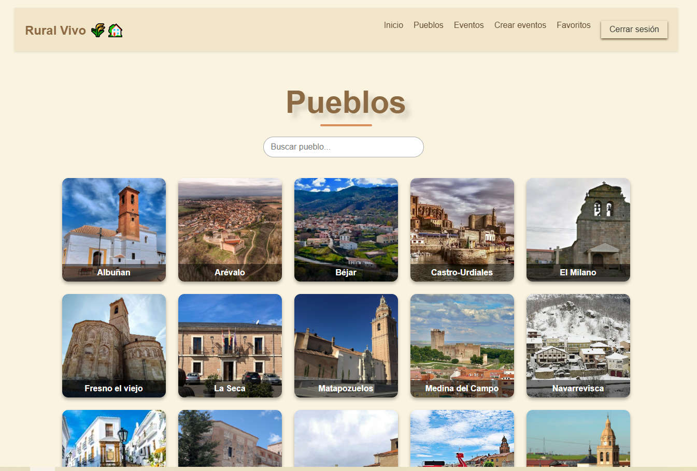
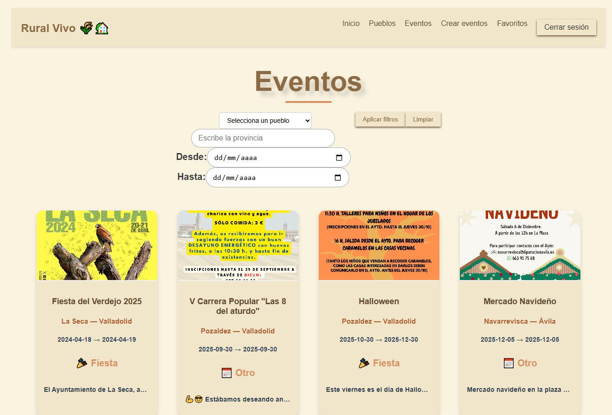

# 🎭 Eventos de Pueblos - Plataforma de Gestión de Eventos Locales

Una aplicación web full-stack para descubrir, crear y gestionar eventos en pueblos de toda España. Permite a los usuarios explorar festividades, ferias y eventos culturales, guardar favoritos y contribuir con información de su comunidad local.


## 📋 Tabla de Contenidos

- [Características](#-características)
- [Tecnologías](#-tecnologías)
- [Requisitos Previos](#-requisitos-previos)
- [Instalación](#-instalación)
- [Configuración](#-configuración)
- [Estructura del Proyecto](#-estructura-del-proyecto)
- [API Endpoints](#-api-endpoints)
- [Uso](#-uso)
- [Capturas de Pantalla](#-capturas-de-pantalla)
- [Autor](#-autor)

## ✨ Características

### Funcionalidades Principales

- 🔐 **Autenticación de Usuarios**
  - Registro e inicio de sesión con email y contraseña
  - Autenticación con Google OAuth
  - Gestión de sesiones con JWT y cookies

- 🎭 **Gestión de Eventos**
  - Visualización de eventos por pueblo, provincia o comunidad autónoma
  - Creación de eventos (usuarios autenticados)
  - Edición inline de eventos propios
  - Eliminación de eventos (solo creador o admin)
  - Filtrado por fecha, ubicación y tipo de evento

- 🏘️ **Exploración de Pueblos**
  - Listado de pueblos con información detallada
  - Visualización en mapa interactivo (Leaflet)
  - Información de ubicación (provincia, CCAA, coordenadas)

- ❤️ **Sistema de Favoritos**
  - Guardar eventos favoritos
  - Acceso rápido a eventos guardados
  - Gestión personal de favoritos

- 🔍 **Búsqueda y Filtros**
  - Búsqueda por pueblo
  - Filtros por provincia, comunidad autónoma
  - Filtros por rango de fechas
  - Filtros por tipo de evento (fiesta, cultural, otro)

## 🛠 Tecnologías

### Backend
- **Node.js** - Entorno de ejecución
- **Express.js** - Framework web
- **PostgreSQL** - Base de datos relacional
- **JWT** - Autenticación y autorización
- **Passport.js** - Autenticación con Google OAuth
- **bcryptjs** - Encriptación de contraseñas
- **cookie-parser** - Manejo de cookies
- **express-session** - Gestión de sesiones
- **dotenv** - Variables de entorno

### Frontend
- **React** - Biblioteca de UI
- **React Router** - Navegación SPA
- **Context API** - Gestión de estado global
- **CSS3** - Estilos personalizados
- **Leaflet** - Mapas interactivos
- **react-loader-spinner** - Indicadores de carga

### Base de Datos
- **PostgreSQL** - Sistema de gestión de base de datos
- **pg** - Cliente de PostgreSQL para Node.js

## 📦 Requisitos Previos

- **Node.js** v18 o superior
- **npm** v8 o superior
- **PostgreSQL** v14 o superior
- Cuenta de **Google Cloud Platform** (para OAuth)

## 🚀 Instalación

### 1. Clonar el repositorio
```bash
git clone https://github.com/tu-usuario/eventos-pueblos.git
cd eventos-pueblos
```

### 2. Instalar dependencias del backend
```bash
npm install
```

### 3. Instalar dependencias del frontend
```bash
cd client
npm install
cd ..
```

### 4. Configurar la base de datos
```bash
# Crear base de datos en PostgreSQL
psql -U postgres
CREATE DATABASE eventos_pueblos;
\q

# Ejecutar script de creación de tablas
psql -U postgres -d eventos_pueblos -f database/schema.sql
```

### 5. Configurar variables de entorno

Crear archivo `.env` en la raíz del proyecto:
```env
# Puerto del servidor
PORT=3000

# Base de datos
DB_HOST=localhost
DB_PORT=5432
DB_NAME=eventos_pueblos
DB_USER=postgres
DB_PASSWORD=tu_password

# JWT
JWT_SECRET=tu_secreto_super_seguro_aqui

# Sesión
SESSION_SECRET=tu_secreto_de_sesion_aqui

# Google OAuth
GOOGLE_CLIENT_ID=tu_google_client_id
GOOGLE_CLIENT_SECRET=tu_google_client_secret
GOOGLE_CALLBACK_URL=http://localhost:3000/api/google/callback

# Frontend
FRONTEND_URL=http://localhost:5173

# Entorno
NODE_ENV=development
```

### 6. Iniciar la aplicación

**Modo desarrollo (Backend y Frontend por separado):**
```bash
# Terminal 1 - Backend
npm run dev

# Terminal 2 - Frontend
cd client
npm run dev
```

**Modo producción:**
```bash
npm run build
npm start
```

## ⚙️ Configuración

### Base de Datos

El esquema de la base de datos incluye las siguientes tablas:

- **Users** - Información de usuarios
- **Pueblos** - Catálogo de pueblos
- **Eventos** - Eventos registrados
- **FavoritosEventos** - Relación usuarios-eventos favoritos

## 📁 Estructura del Proyecto
```
ruralvivo/
├── frontend/                          # Frontend React
│   ├── src/
│   │   ├── components/
│   │   │   ├── Footer/             
│   │   │   ├── Header/           
│   │   │   └── Main/               
    │   │      ├── CreateEvent/    
    │   │      ├── Eventos/   
        │      │   ├── EventosList/ 
               │   │   └── EventosCard/             
        │      │   └── Search/ 
    │   │      ├── EventosDetalle/    
               │   │   ├── BotonBorrarEditar/ 
               │   │   ├── Map/ 
               │   │   └── BotonFavoritos/             
    │   │      ├── Favoritos/          
    │   │      ├── Profile/    
    │   │      ├── Login/            
    │   │      ├── Pueblos/    
        │      │   ├── EventosList/ 
               │   │   └── EventosCard/             
        │      │   └── Search/         
    │   │      ├── PueblosDetalle/
        │      │   └── Map/ 
    │   │      ├── Singup/            
    │   │      └── Home/    
        │          ├── CTASection/ 
        │          ├── FeatureSection/ 
        │          └── SectionCards/             
│   │   ├── context/                # Context API
│   │   │   └──  UserContext/        
│   │   ├── services/               # Servicios API
│   │   │   ├── EventosService/            # Gestión de eventos
│   │   │   ├── PueblosService/            # Exploración de pueblos
│   │   │   ├── FavoritosService/          # Sistema de favoritos
│   │   │   └── UserService/               # Página principal
│   │   └── App.jsx                 # Componente principal
│   └── package.json
│
├── backend/                          # Backend Nos¡de.js
    ├── src/
    │   ├── config/
    │   │   ├── db_sql.js              # Configuración PostgreSQL
    │   │   ├── jwt.js                 # Configuración JWT
    │   │   └── googleAuth.js          # Configuración OAuth
    │   ├── controller/
    │   │   ├── authController.js      # Lógica de autenticación
    │   │   ├── eventosController.js   # Lógica de eventos
    │   │   ├── pueblosController.js   # Lógica de pueblos
    │   │   ├── favoritosController.js # Lógica de favoritos
    │   │   └── userController.js      # Lógica de usuarios
    │   ├── middleware/
    │   │   ├── authMiddleware.js      # Verificación JWT
    │   │   └── isOwner.js             # Verificación de propiedad
    │   ├── models/
    │   │   └── userModels.js          # Modelos de usuario
    │   └── routes/
    │       ├── authRoutes.js          # Rutas de autenticación
    │       ├── eventosRoutes.js       # Rutas de eventos
    │       ├── pueblosRoutes.js       # Rutas de pueblos
    │       ├── favoritosRoutes.js     # Rutas de favoritos
    │       └── userRoutes.js          # Rutas de usuario
    │  
    ├── index.js
    ├── .env
    ├── .gitignore 
    └── package.json
└── README.md
```

## 🔌 API Endpoints

### Autenticación
```http
POST   /api/signup              # Registro de usuario
POST   /api/login               # Login con credenciales
POST   /api/logout              # Cerrar sesión
GET    /api/me                  # Obtener usuario actual
GET    /api/auth/google         # Iniciar OAuth con Google
GET    /api/google/callback     # Callback de Google OAuth
```

### Eventos
```http
GET    /api/eventos                    # Obtener todos los eventos (con filtros)
GET    /api/eventos/:id                # Obtener evento por ID
GET    /api/pueblos/:id/eventos        # Obtener eventos de un pueblo
POST   /api/eventos                    # Crear evento (auth)
PUT    /api/eventos/:id                # Actualizar evento (auth + owner)
DELETE /api/eventos/:id                # Eliminar evento (auth + owner)
```

### Pueblos
```http
GET    /api/pueblos                    # Obtener todos los pueblos
GET    /api/pueblos/:id                # Obtener pueblo por ID
```

### Favoritos
```http
GET    /api/favoritos                  # Obtener favoritos del usuario (auth)
POST   /api/favoritos                  # Añadir a favoritos (auth)
DELETE /api/favoritos/:evento_id       # Eliminar de favoritos (auth)
GET    /api/favoritos/:evento_id/check # Verificar si es favorito (auth)
```

### Usuario
```http
GET    /api/profile                    # Obtener perfil del usuario (auth)
PUT    /api/profile                    # Actualizar perfil (auth)
GET    /api/profile/stats              # Obtener estadísticas (auth)
```

## 💻 Uso

### Registro e Inicio de Sesión

1. Crear una cuenta desde `/signup` 
2. Iniciar sesión desde `/login`

### Explorar Eventos

1. Ir a `/eventos` para ver todos los eventos
2. Usar filtros para buscar por pueblo, provincia, fecha, etc.
3. Hacer clic en un evento para ver detalles completos

### Crear un Evento

1. Estar autenticado
2. Ir a `/creas-eventos`
3. Completar el formulario con información del evento
4. Guardar

### Gestionar Eventos Propios

1. En la tarjeta o detalle del evento, verás botones de editar/eliminar
2. **Editar**: Modificar información inline o en página dedicada
3. **Eliminar**: Confirmación antes de eliminar permanentemente

### Guardar Favoritos

1. Hacer clic en el corazón 🤍 en cualquier evento
2. El corazón se llenará ❤️ indicando que está guardado
3. Acceder a favoritos desde `/favoritos`

### Gestionar Perfil

1. Ir a `/profile`
2. Ver estadísticas personales
3. Editar información personal o cambiar contraseña

## 📸 Capturas de Pantalla

### Página Principal


### Listado de Pueblos


### Listado de Evento



## 👨‍💻 Autor

Paula Rodriguez Garabaya
- GitHub: [@tu-usuario](https://github.com/PaulaGarabaya)
- LinkedIn: [Tu Perfil](https://www.linkedin.com/in/paula-rodriguez-garabaya/)


